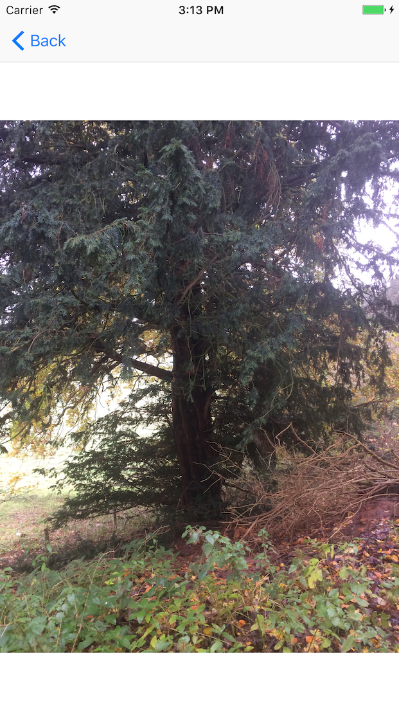

# TWGOperations

[](https://travis-ci.org/Nicholas Kuhne/TWGOperations)
[](http://cocoapods.org/pods/TWGOperations)
[](http://cocoapods.org/pods/TWGOperations)
[](http://cocoapods.org/pods/TWGOperations)


`TWGOperations` is a library for iOS and Mac OS X. It's built on top of [NSOperation](https://developer.apple.com/library/mac/documentation/Cocoa/Reference/NSOperation_class/), providing concurrency and code organization to an application. 

The creation of this library was directly inspired from a talk given at Apple WWDC 2015.
[Video](https://developer.apple.com/videos/play/wwdc2015/226/) ,
[Example Project](https://developer.apple.com/sample-code/wwdc/2015/downloads/Advanced-NSOperations.zip)
Full credit is given the the Apple team for the vision of an Operation centric application.

### Bias
This library provides tools for quickly and easily implementing structured asynchronous tasks and great concurrency management using Apples `NSOperation` suite. **But it also prescribes a method of implementation and usage.** and we believe that there are good and bad ways of using both `NSOperation` and `TWGOperation` \ `TWGGroupOperation` libraries.

We have found that the `TWGOperation` library provides a **simple** way to remove complex tasks from view controllers, a good interface for **unit testing**, and an **approachable** way to learn concurrency and threading.


## How to get started

#### Have a Go!
Want to have a quick look at the **sweet sample project** written using the `TWGOperation` library?
Try out the TWGOperations Example project using [CocoaPods](https://cocoapods.org)

**In your terminal:** `pod try TWGOperations`

## Installation

### Installation with CocoaPods
TWGOperations is available through [CocoaPods](http://cocoapods.org). To install
it, simply add the following line to your Podfile:

```ruby
pod "TWGOperations"
```

## Overview

### TWGOperation
A `TWGOperation` is the foundation of this library. If provides two simple features:

##### 1: Asynchronous completion
* Unlike an `NSOperation`, a `TWGOperation` will not complete at the end of the execution method, the developer must explicitly call `- (void)finish` to notify the `NSOperationQueue` that it no longer needs to execute.

##### 2: Callbacks
* A `TWGOperation` uses the [delegate pattern](https://developer.apple.com/library/ios/documentation/General/Conceptual/DevPedia-CocoaCore/Delegation.html) to inform a caller of completion or failure

##### Usage

```objective-c
@interface TWGOperation : NSOperation
@property (nonatomic, weak) id<TWGOperationDelegate> delegate;
@end

@interface TWGOperation (SubclassingHooks)
/*
 Override this to implement execution
 */
- (void)execute;

/*
 TWGOperation subclasses must call this to complete execution of the operation
 */
- (void)finish;
@end
```

A `TWGOperation` can be added to a operation queue and executed by:

```objective-c
	MyOperationSubclass *operation = [[MyOperationSubclass alloc] init];
	[[NSOperationQueue mainQueue] addOperation:operation];
```


##### Delegation

A `TWGOperation` use a delegate to inform a caller of completion or failure

```objective-c
@protocol TWGOperationDelegate <NSObject>
- (void)operation:(nonnull TWGOperation *)operation didCompleteWithResult:(nullable id)result NS_SWIFT_NAME(operationDidComplete(operation:withResult:));
- (void)operation:(nonnull TWGOperation *)operation didFailWithError:(nullable NSError *)error NS_SWIFT_NAME(operationDidFail(operation:withError:));
@end
```

#### Advanced
The developer is afforded quick access to both `- (void)finish` and the `TWGOperationDelegate` protocol methods using:

```objective-c
@interface TWGOperation (QuickDelegate)
/*
 Convenience completion

 Subclasses should use these as short hand for the process:
 1. Inform delegate of complete or fail
 2. -finish
 */
- (void)finishWithResult:(id _Nullable)result NS_SWIFT_NAME(finish(withResult:));
- (void)finishWithError:(NSError * _Nullable)error NS_SWIFT_NAME(finish(withError:));
@end
```

This is the preferred method of completion and should be used even if no error or result is needed.

```objective-c
[self finishWithResult:nil];
```
or

```objective-c
[self finishWithError:nil];
```

### TWGGroupOperation
A `TWGGroupOperation` is a subclass of `TWGOperation` which encapsulates operations and needs no `- (void)execute` method.
This is done by executing `NSOperation` or `TWGOperation` subclasses on an internal `NSOperationQueue`

```objective_c
@interface TWGGroupOperation : TWGOperation

@property (nonatomic, strong, readonly) NSOperationQueue *operationQueue;

/*
 initWithOperations: adds operations passed to the operationQueue
 subclasses need create sub-operations then [super initWithOperations:]
 to have them execute
 */
- (instancetype)initWithOperations:(NSArray<NSOperation *> *)operations;

/*
 Subclasses of TWGGroupOperation SHOULD NOT override -execute
 See TWGOperation for further subclassing instructions
 */
 - (void)execute NS_UNAVAILABLE;

@end
```

#### Usage
A `TWGGroupOperation` is designed to be subclassed and respond to the delegate callbacks of its sub-operations
See the `TWGOperation_Example` project for examples.

A `TWGGroupOperation` can be added to a operation queue and executed by in the same way a `TWGOperation` is:

```objective-c
	MyGroupOperationSubclass *operation = [[MyGroupOperationSubclass alloc] init];
	[[NSOperationQueue mainQueue] addOperation:operation];
```

## Example Project
### About Flickr API

The Flickr REST API is a great example of a rest API that requires several chained API calls to retrieve the final product  

A Call for the endpoint:

`https://api.flickr.com/services/rest/?method=flickr.photos.getRecent`

results in an array of objects similar to:

```javascript
{
  "id": "30379955494",
  "owner": "86866994@N00",
  "secret": "5c84551928",
  "server": "5731",
  "farm": 6,
  "title": "Frosty leaves",
  "ispublic": 1,
  "isfriend": 0,
  "isfamily": 0
}
```

to get URL's for photos you can call:

`https://api.flickr.com/services/rest/?method=flickr.photos.getSizes&photo_id=30379955494`

resulting in something like:

```javascript
{
    sizes =     {
        size =         (
                        {
                height = 75;
                label = Square;
                media = photo;
                source = "https://farm6.staticflickr.com/5791/30413623884_ae2f143b5a_s.jpg";
                url = "https://www.flickr.com/photos/145345660@N03/30413623884/sizes/sq/";
                width = 75;
            },
            {
                height = 528;
                label = Large;
                media = photo;
                source = "https://farm6.staticflickr.com/5791/30413623884_ae2f143b5a_b.jpg";
                url = "https://www.flickr.com/photos/145345660@N03/30413623884/sizes/l/";
                width = 1024;
            }
        );
    };
    stat = ok;
}
```
which gives us the URL's needed to fetch any individual image.

The Flickr `flickr.photos.getRecent` API method returns a first page on 100 items. 

So to fetch the first 100 images in the recent photos list, you need to perform

* 1 x `flickr.photos.getRecent`
* 100 x `flickr.photos.getSizes`
* 100 X `https://www.flickr.com/photos/id/sizes/l/`

TWGOperaitons can help to alleviate this burden by providing both the scheduling and dependancy of an NSOperation, as well as the the error checking and retrying required when dealing with any network request.

Refer to the `FetchFlickrFeedOperation` for further details about how to implement a solution.

### Screenshots



## Testing
A test suite is available as part of the `TWGOperation_Example` project available through [CocoaPods](http://cocoapods.org). 

## Author
Proudly, Nicholas Kuhne, nkuhne@twg.io

## License

TWGOperations is available under the MIT license. See the LICENSE file for more info.
